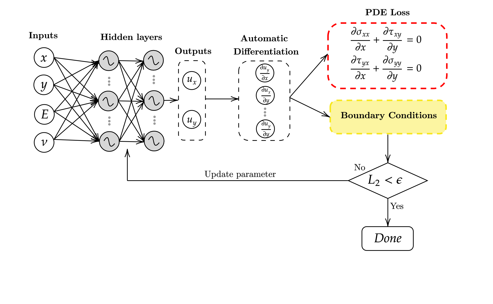
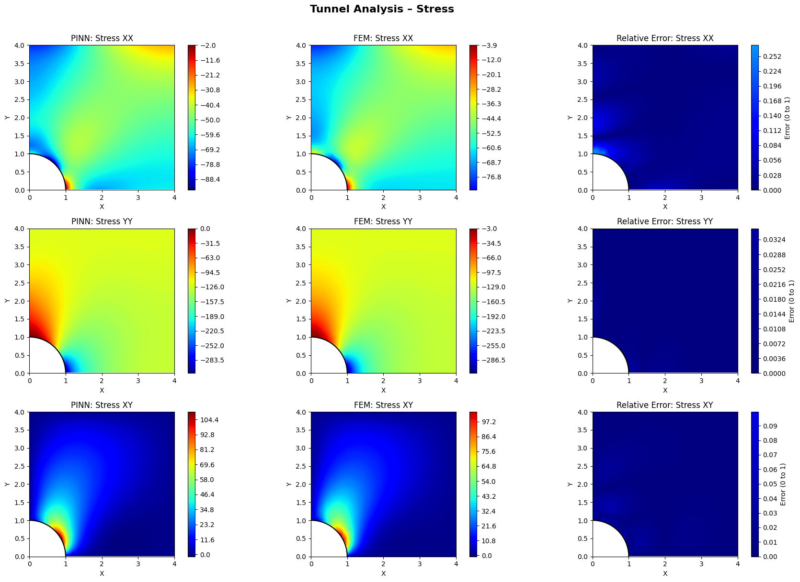

# Deep Tunnel PINN — Physics-Informed Neural Networks for Geomechanics

A PyTorch implementation of Physics-Informed Neural Networks (PINNs) for solving plane-strain elasticity in a deep tunnel problem, with extensions for parametric surrogate modelling and material parameter identification via inverse analysis.

---

## Overview

This project addresses a **quarter-domain tunnel problem**: a 4 m × 4 m region with a circular tunnel cutout of radius R = 1 m, subjected to a distributed compressive load of −0.120 MPa on the top edge. Three notebooks build on each other in increasing complexity:

| Notebook | Purpose |
|---|---|
| `Deep_Tunnel.ipynb` | Baseline PINN for fixed material parameters |
| `Parametric_Surrogate_DeepTunnel.ipynb` | Surrogate model via weight interpolation over an (E, ν) grid |
| `Inverse_analysis.ipynb` | Inverse PINN that recovers E and ν from observed displacement/stress data |

---

## Results

### PINN Architecture & Training

*Physics-Informed Neural Network architecture: the network takes spatial coordinates (x, y) as input and outputs displacements (u, v), with PDE residuals and boundary conditions enforced through the loss function.*

### Collocation Points
_.png)
*Adaptive collocation point distribution over the quarter-domain. Points are sampled with higher density near the curved tunnel wall (x² + y² = 1) where stress gradients are largest.*

### PINN vs FEM Stress Comparison

*Stress field comparison between PINN predictions (left) and FEM reference solution (middle), with relative error maps (right) for σ_xx, σ_yy, and σ_xy. The PINN achieves low relative errors across the domain, with slightly higher errors near the stress concentration at the tunnel wall.*

---

## Problem Setup

**Domain:** Quarter-disk annulus, x ∈ [0, 4] m, y ∈ [0, 4] m, with the circular tunnel hole x² + y² < R² removed.

**Boundary conditions (plane strain):**

- **Bottom** (y = 0): vertical roller — v = 0, σ_xy = 0
- **Left** (x = 0): symmetry — u = 0, σ_xy = 0
- **Right** (x = 4): symmetry — u = 0, σ_xy = 0
- **Top** (y = 4): σ_xy = 0; σ_yy = −0.120 MPa (distributed compression)
- **Curved wall** (x² + y² = 1): traction-free — σ_n = 0, σ_t = 0

**Governing equations:** Linear elasticity equilibrium in plane strain:

```
∂σ_xx/∂x + ∂σ_xy/∂y = 0
∂σ_xy/∂x + ∂σ_yy/∂y = 0
```

---

## Network Architecture

All three notebooks share the same neural network structure, which is a prerequisite for weight interpolation in the surrogate model:

```
Input: (x, y) → 2 neurons
Hidden: 5 × [Linear(128) → tanh]
Output: (u, v) → 2 neurons   # horizontal and vertical displacement
```

---

## Notebooks

### 1. `Deep_Tunnel.ipynb` — Baseline PINN

Trains a single PINN for fixed material parameters (E = 20 MPa, ν = 0.3). The loss function combines:

- **PDE residual loss** — equilibrium equations enforced at collocation points inside the domain
- **Boundary condition loss** — Dirichlet and Neumann conditions on all five boundary segments

Collocation points are sampled with adaptive density: higher point concentration near the curved tunnel wall where stress gradients are largest.

**Output:** Displacement fields u(x, y) and v(x, y), stress fields σ_xx, σ_yy, σ_xy.

---

### 2. `Parametric_Surrogate_DeepTunnel.ipynb` — Weight Interpolation Surrogate

Extends the baseline to a **parametric surrogate** that can predict the displacement field for any (E, ν) within the training grid, without retraining.

**Approach:**

1. Train 9 independent PINNs on a 3 × 3 grid of material parameters:
   - E ∈ {10, 20, 30} MPa
   - ν ∈ {0.1, 0.2, 0.3}
2. Save all network weights to `surrogate_weights/surrogate_archive.pth`
3. At query time, interpolate every weight and bias tensor independently using `scipy.interpolate.RegularGridInterpolator` (bilinear on the 3 × 3 grid)
4. Load the interpolated weights into a fresh `Net` instance — no retraining required

**Usage:**

```python
surrogate = ParametricSurrogate('surrogate_weights/surrogate_archive.pth')
net = surrogate.get_net(E=15.0, nu=0.25)
# net is now ready for inference at the queried (E, ν)
```

All 9 networks are initialised with the same random seed (`torch.manual_seed(0)`) to ensure a smooth weight manifold for interpolation.

---

### 3. `Inverse_analysis.ipynb` — Material Parameter Identification

Solves the **inverse problem**: given sparse observed displacement and stress data at measurement points, recover the unknown material parameters E and ν.

**Approach:**

E and ν are treated as learnable scalar parameters, optimised jointly with the network weights. To enforce physical bounds (E > 0, 0 < ν < 0.5), they are reparameterised in log-space:

```python
log_E  = torch.tensor([-10.0], requires_grad=True)
log_nu = torch.tensor([-1.466], requires_grad=True)

E  = torch.exp(log_E)
nu = torch.sigmoid(log_nu) * 0.49 + 0.01
```

**Loss function:**

```
L_total = L_PDE + L_BC + L_data
```

where `L_data` is the MSE between PINN predictions and observed displacements (u, v) and stresses (σ_xx, σ_yy, σ_xy) at measurement locations. Stress data is expected in kPa and is converted to MPa internally.

**Input data format** (CSV):

```
X, Y, ux, uy, stress_xx, stress_yy, stress_xy
```

---

## Installation

```bash
pip install torch torchvision numpy matplotlib scipy pandas tqdm
```

GPU is automatically used if available (`torch.device("cuda")`).

---

## Repository Structure

```
.
├── Deep_Tunnel.ipynb                        # Baseline single-case PINN
├── Parametric_Surrogate_DeepTunnel.ipynb    # Surrogate via weight interpolation
├── Inverse_analysis.ipynb                   # Inverse PINN for E, ν recovery
├── surrogate_weights/                       # Auto-created; stores trained weight archives
│   └── surrogate_archive.pth
├── diagram-20260503.png                     # PINN architecture diagram
├── image__1_.png                            # Collocation point distribution
└── image.png                               # PINN vs FEM stress comparison
```

---

## Key Parameters

| Parameter | Default | Description |
|---|---|---|
| `R_TUNNEL` | 1.0 m | Tunnel radius |
| `E` | 20.0 MPa | Young's modulus (baseline / inverse target) |
| `nu` | 0.3 | Poisson's ratio (baseline / inverse target) |
| `LOAD_VAL` | −0.120 MPa | Distributed compressive load on top edge |
| `N_EPOCHS` | 100 | Training epochs per PINN case |
| `LR` | 0.001 | Learning rate (Adam + CosineAnnealingLR) |
| `E_VALUES` | [10, 20, 30] MPa | Surrogate training grid |
| `NU_VALUES` | [0.1, 0.2, 0.3] | Surrogate training grid |

---

## Methods Summary

| Component | Implementation |
|---|---|
| Neural network | 5-layer MLP, tanh activations, 128 neurons/layer |
| Automatic differentiation | `torch.autograd.grad` with `create_graph=True` |
| Constitutive model | Plane-strain linear elasticity |
| Collocation sampling | Adaptive — higher density near tunnel arc |
| Optimiser | Adam with CosineAnnealingLR scheduler |
| Surrogate interpolation | `scipy.interpolate.RegularGridInterpolator` (bilinear) |
| Inverse parameterisation | Log-space reparameterisation for positivity constraints |

---

## References

- Raissi, M., Perdikaris, P., & Karniadakis, G. E. (2019). Physics-informed neural networks: A deep learning framework for solving forward and inverse problems involving nonlinear partial differential equations. *Journal of Computational Physics*, 378, 686–707.
- Haghighat, E., Raissi, M., Moure, A., Gomez, H., & Juanes, R. (2021). A physics-informed deep learning framework for inversion and surrogate modeling in solid mechanics. *Computer Methods in Applied Mechanics and Engineering*, 379, 113741.
